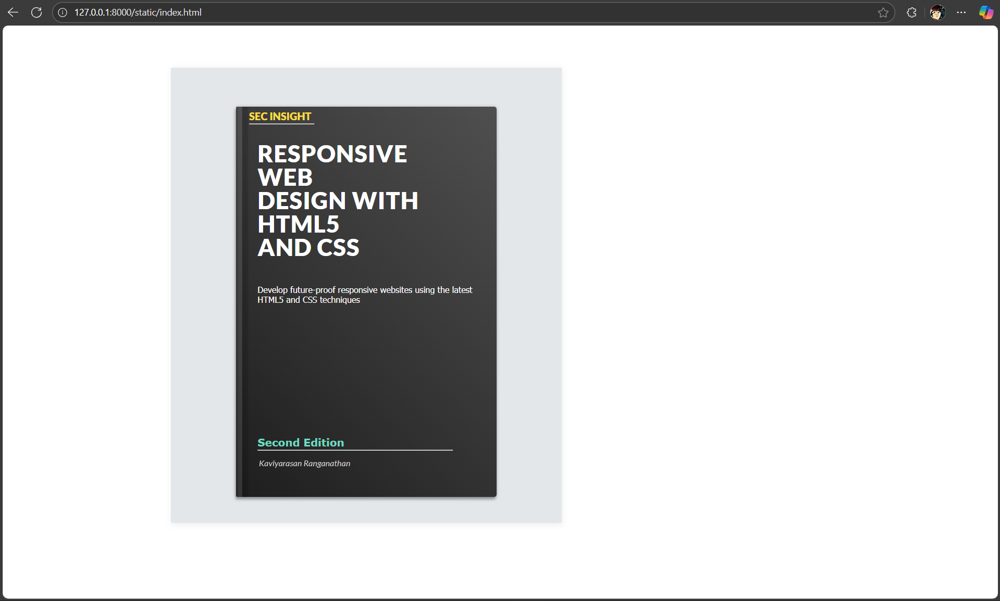

# Ex.05 Book Cover Page Design

## Date:01-11-2025

## AIM:

To design a book back cover page using HTML and CSS.

## DESIGN STEPS:

### Step 1:

Create a Django Admin project.

### Step 2:

Create an app in the Django interface.

### Step 3:

Create a folder named 'static' in the app folder.

### Step 4:

Create a new HTML file in the static folder.

### Step 5:

Write the HTML code with relevant CSS properties.

### Step 6:

Choose the appropriate style and color scheme.

### Step 7:

Insert the images in their appropriate places.

### Step 8:

Publish the website in the LocalHost.

## PROGRAM:

index.html

```html
<!DOCTYPE html>
<html lang="en">
  <head>
    <meta charset="UTF-8" />
    <title>084 - Book Cover</title>
    <link
      rel="stylesheet"
      href="https://public.codepenassets.com/css/normalize-5.0.0.min.css"
    />
    <link rel="stylesheet" href="./style.css" />
  </head>

  <body>
    <div class="frame">
      <div class="book">
        <div class="insight">SEC INSIGHT</div>
        <div class="hrstyle">
          <hr style="color: yellow;" />
        </div>

        <div class="title">
          <div class="big">
            Responsive<br />Web<br />Design with HTML5<br />and CSS
          </div>
          <div class="subtitle">
            Develop future-proof responsive websites using the latest HTML5 and
            CSS techniques<br /><br />
          </div>
          <div class="id">
            <hr style="color: orange;" />
          </div>
          <div class="small">Kaviyarasan Ranganathan</div>
          <div class="ed">
            <b>Second Edition</b>
          </div>
        </div>
      </div>
    </div>
  </body>
</html>
```

style.css

```css
@import url(https://fonts.googleapis.com/css?family=Lato:900,400italic);
.frame {
  position: absolute;
  top: 30%;
  left: 30%;
  width: 600px;
  height: 700px;
  margin-top: -200px;
  margin-left: -200px;
  border-radius: 2px;
  box-shadow: 1px 2px 10px 0px rgba(0, 0, 0, 0.07);
  overflow: hidden;
  background: #e3e7ea;
  color: #fff;
  font-family: "Lato", Helvetica, sans-serif;
  -webkit-font-smoothing: antialiased;
  -moz-osx-font-smoothing: grayscale;
}

.book {
  position: absolute;
  width: 400px;
  height: 600px;
  top: 60px;
  left: 100px;
  border-radius: 2px 4px 4px 2px;
  box-shadow: 0 0 5px 0 rgba(0, 0, 0, 0.2), -1px 4px 4px 0 rgba(0, 0, 0, 0.3);
  background: #1e1e1e;
  background: linear-gradient(45deg, #1e1e1e 0%, #4f4f4f 100%);
  filter: progid:DXImageTransform.Microsoft.gradient( startColorstr="#1e1e1e", endColorstr="#4f4f4f",GradientType=1 );
}
.book:before {
  content: "";
  display: block;
  position: absolute;
  width: 20px;
  top: 0;
  left: 0;
  bottom: 0;
  border-radius: 2px 0 0 2px;
  /* http://colorzilla.com/gradient-editor/#ffffff+45,000000+49&0+0,0.15+20,0.15+84,0+100 */
  background: linear-gradient(
    to right,
    rgba(255, 255, 255, 0) 0%,
    rgba(255, 255, 255, 0.1) 20%,
    rgba(255, 255, 255, 0.1) 45%,
    rgba(0, 0, 0, 0.15) 49%,
    rgba(0, 0, 0, 0.15) 84%,
    rgba(0, 0, 0, 0) 100%
  );
  filter: progid:DXImageTransform.Microsoft.gradient( startColorstr="#00ffffff", endColorstr="#00000000",GradientType=1 );
}
.book .insight {
  color: #ffdd40;
  position: absolute;
  top: 1%;
  left: 5%;
}
.book .hrstyle {
  color: black;
  width: 100px;
  position: absolute;
  top: 3%;
  left: 5%;
}
.book .subtitle {
  font-family: Tahoma;
  font-size: small;
  position: relative;
  top: 40px;
}
.book .id {
  position: relative;
  top: 240px;
  width: 300px;
}
.book .ed {
  color: #6edbc1;
  font-size: medium;
  font-family: Verdana;
  position: relative;
  top: 210px;
}
.book .title {
  position: absolute;
  top: 55px;
  left: 33px;
}
.book .title .big {
  font-size: 36px;
  line-height: 100%;
  font-weight: 900;
  text-transform: uppercase;
  letter-spacing: 1px;
}
.book .title .small {
  font-size: 13px;
  line-height: 160%;
  font-weight: 400;
  font-style: italic;
  padding-left: 2px;
  color: #ccc;
  position: absolute;
  top: 185%;
}
```

## OUTPUT:



## RESULT:

The program for designing book back cover page using HTML and CSS is completed successfully.
